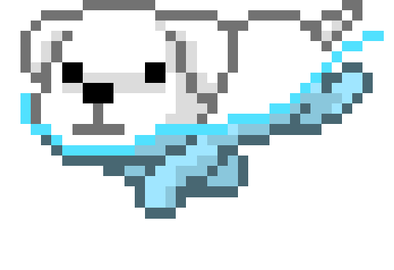

### Hi there 🤙🏽

I'm a **passionate** software engineer from france 🇫🇷

 

  

  🔭 I am currently working for **Indy** as a software engineer
   

  
   
<!--
  
   
-->

<!-- my-badges start -->

<!-- my-badges end -->

![gif][dropped]

---

[![LinkedIn][linkedin-shield]][linkedin-url]

<!-- VARIABLES SECTION -->

[linkedin-shield]: https://img.shields.io/badge/-LinkedIn-black.svg?style=for-the-badge&logo=linkedin&colorB=555555
[linkedin-url]: https://www.linkedin.com/in/horeb-parraud/

[dropped]: ./dropped_orb.gif

<!-- SAVE SECTION

![Horeb's GitHub stats][card]

 

[foregroundColor]: #0f0d19
[backgroundColor]: #252334
[selectionColor]: #15141d
[borderColor]: #0f0f0f
[red]: #ff7372
[green]: #a7ff70
[yellow]: #ffe875
[blue]: #8de6ff
[cyan]: #6cffd0
[white]: #dbdbdb

[card]: https://github-readme-stats.vercel.app/api?username=HorebZ&count_private=true&hide=contribs,prs,issues&show_icons=true&title_color=ff7372&icon_color=6cffd0&text_color=dbdbdb&bg_color=252334&hide_border=TRUE

 

-->

